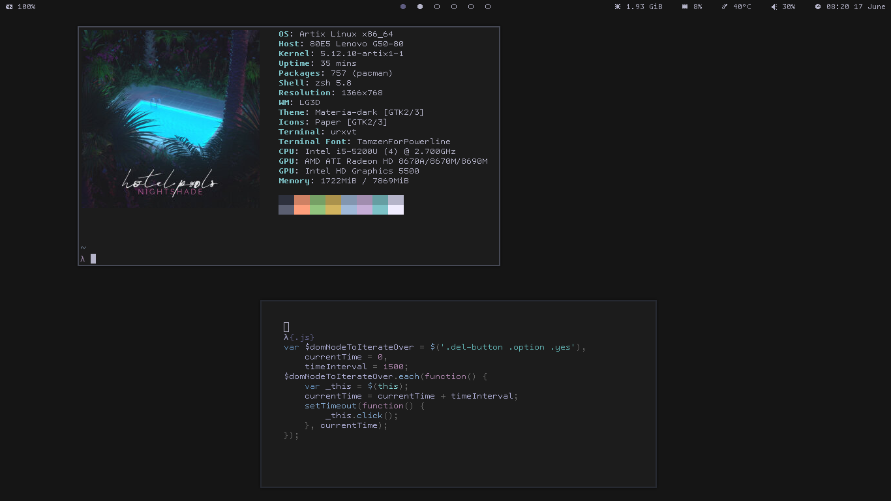

# ~/.dots

Personal dot files

## Application

| Apps                 | I use             |
| -------------------- | ----------------- |
| Window Manager       | bspwm             |
| Text Editor          | (Neo)Vim          |
| Terminal             | Kitty and urxvt   |
| Bar                  | Polybar           |
| Compositor           | Picom             |
| Application Launcher | Rofi              |
| Filemanager          | Ranger and Thunar |
| Web browser          | firefox           |
| Pdf Reader           | Zathura           |
| Email Client         | Neomutt           |
| Wallpaper            | #1c1c1c           |

## Fonts

- [Uw Ttyp0](https://people.mpi-inf.mpg.de/~uwe/misc/uw-ttyp0/)
- [Cascadia Code](https://github.com/microsoft/cascadia-code.git)

## Key bindings

Super is modkey

| Keybind             | Action                          |
| ------------------- | ------------------------------- |
| `super + Return`    | Terminal                        |
| `super + space`     | rofi                            |
| `super + f`         | thunar                          |
| `super + {1-9,0}`   | focus on the `0-9` desktop      |

*any many more*
